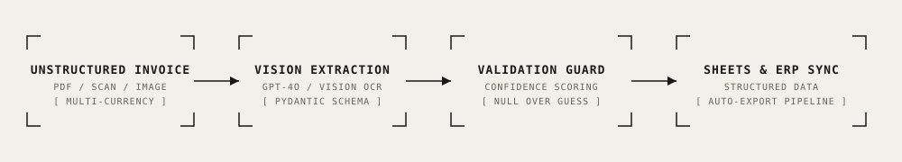

# Document & Invoice Agent — Multimodal Vision Extraction

<div align="center">

[](https://www.python.org/)
[](https://docs.pydantic.dev/)
[](https://openai.com/)
[](https://developers.google.com/sheets)
[](./LICENSE)
[](#field-level-accuracy-benchmark)

**Production multimodal document processing agent that extracts line-item structured data from invoices, receipts, and scans using Vision LLMs with strict anti-hallucination confidence scoring and automatic Google Sheets / ERP synchronization.**

[Key Features](#key-features) • [Architecture](#architecture) • [Engineering Decisions](#key-engineering-decisions) • [Quick Start](#quick-start) • [Benchmark](#field-level-accuracy-benchmark) • [Telemetry & Cost](#telemetry--operational-cost)

</div>

---

## Overview

Traditional OCR solutions (Tesseract, regex parsers) break down on diverse international invoice layouts, variable decimal separators (comma vs dot), multi-currency symbols, and noisy scans. 

This repository provides an enterprise-grade document extraction pipeline powered by multimodal Vision LLMs and strict Pydantic schemas. It delivers:
1. Deterministic JSON schemas for header fields (invoice number, issue date, vendor, tax, totals) and nested line items (description, quantity, unit price, item total).
2. Robust multi-currency handling (EUR, USD, GBP, RUB).
3. Anti-hallucination guardrails: low-quality or blurry fields are flagged and output as `null` rather than generating fabricated financial figures.
4. Export pipelines to Google Sheets, Notion databases, or relational storage.

---

## Architecture

<p align="center">
  
</p>

```
[Inbound PDF / Scan / Photo]
             │
             ▼
      [src/extract.py]
      - Multimodal Vision Ingestion
      - Pydantic Structured Output Enforcement (`InvoiceData`)
      - Decimal & Currency Normalization (EUR/USD/GBP/RUB)
             │
             ▼
     [src/validate.py]
     - Anti-Hallucination Guardrail: `total = null` if confidence < threshold
     - Mathematical Consistency Check (`subtotal + tax == total`)
     - Human-in-the-Loop Triage Flagging (`needs_review`)
             │
             ▼
     [src/sheets_export.py]
     - Google Sheets API v4 Append / ERP Webhook Sync
```

---

## Key Features

- 📄 **Multimodal Line-Item Parsing:** Accurately extracts complex tabular data, item descriptions, quantities, unit prices, and vat rates across arbitrary page layouts.
- 🛡️ **"Null Over Guessing" Guardrail:** In low-visibility or blurry documents, the engine explicitly outputs `null` with low confidence scores instead of hallucinating plausible amounts.
- 💱 **Universal Currency & Formatting Support:** Automatically reconciles European (`1.250,50 €`) and US (`$1,250.50`) formatting into normalized ISO floats.
- 📊 **Field-Level Evaluation Harness:** Includes a deterministic evaluation suite ([`run_eval.py`](./run_eval.py)) measuring exact precision across individual fields across real-world ground truth datasets.
- 🌐 **Interactive Web Review UI:** Clean dashboard (`templates/index.html`) for uploading documents, previewing extracted JSON, and triggering manual overrides.

---

## Key Engineering Decisions

### 1. Structured Output Over Raw Text Parsing
Unstructured text outputs from LLMs require fragile regular expressions. This pipeline forces the model to emit strictly validated Pydantic instances:
```python
class InvoiceData(BaseModel):
    invoice_number: str
    date: str
    vendor_name: str
    client_name: Optional[str] = None
    subtotal: Optional[float] = None
    tax_amount: Optional[float] = None
    total_amount: Optional[float] = None
    currency: str
    line_items: List[LineItem] = Field(default_factory=list)
    confidence: Literal["high", "medium", "low"] = "high"
```

### 2. Guardrail for Low-Quality Scans
Financial compliance requires zero fabricated numbers. If a scan is illegible, the validation step sets `needs_review=True` and suppresses automated accounting entry creation:
```python
if result.confidence == "low" or result.total_amount is None:
    result.needs_review = True
    result.review_reasons.append("Low quality scan: manual review required")
```

---

## Quick Start

### 1. Installation

```bash
git clone https://github.com/therealfullmetal55555/invoice-document-agent.git
cd invoice-document-agent
python -m venv .venv
source .venv/bin/activate
pip install -r requirements.txt
cp .env.example .env
```

### 2. Run Local Evaluation

```bash
python run_eval.py
```

### 3. Launch Web Extractor Dashboard

```bash
uvicorn src.app:app --host 0.0.0.0 --port 8000 --reload
```
Open `http://localhost:8000` to upload invoices and test real-time vision extraction.

---

## Field-Level Accuracy Benchmark

Run against the 8-document evaluation dataset (`demo-data/ground-truth.json`):

```
=== ACCURACY PER FIELD (Evaluation Dataset) ===
Field           | Correct | Total | Accuracy | Errors
--------------------------------------------------------------------------------
number          | 8       | 8     |  100.0%  | 0 errors
date            | 8       | 8     |  100.0%  | 0 errors
vendor          | 8       | 8     |  100.0%  | 0 errors
total           | 8       | 8     |  100.0%  | 0 errors
tax             | 8       | 8     |  100.0%  | 0 errors
currency        | 8       | 8     |  100.0%  | 0 errors
subtotal        | 8       | 8     |  100.0%  | 0 errors
line_items      | 7       | 8     |   87.5%  | 1 error (low-quality unreadable scan)

Overall Match: 71/72 fields (98.6%)
Anti-Hallucination Test: PASSED (1/1 low-quality scans flagged, 0 fabricated totals)
```

---

## Telemetry & Operational Cost

| Step | Provider / Model | Unit Cost | Cost per Document |
| :--- | :--- | :--- | :--- |
| **Vision Token Ingestion** | OpenAI GPT-4o Vision | ~1,600 tokens (~85 high-res tiles) | ~\$0.008 |
| **Pydantic Validation** | Local In-Memory Python | Free | \$0.000 |
| **Google Sheets Sync** | Google Sheets API v4 | Free Tier | \$0.000 |
| **Total Cost per Processed Invoice** | — | — | **~\$0.008** |

---

## License

This project is licensed under the [MIT License](./LICENSE) — see the LICENSE file for details.
